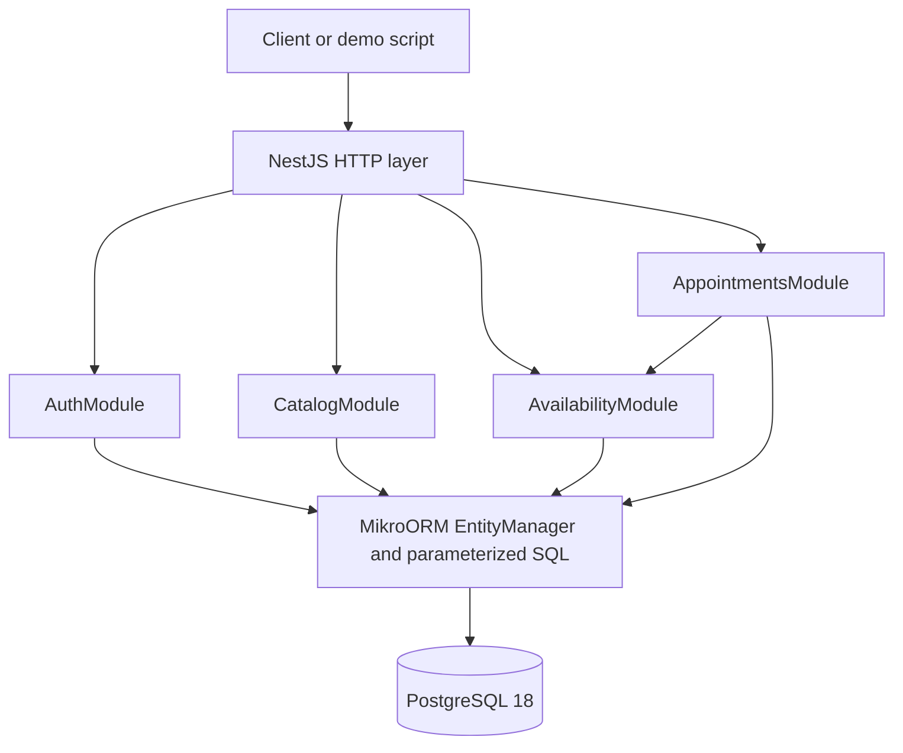

# Solution Design — Unified Service Scheduler

- **Challenge:** Keyloop Technical Assessment — Scenario A
- **Implementation focus:** Backend service
- **Primary stack:** TypeScript, NestJS, MikroORM and PostgreSQL 18
- **Document status:** Implemented design, reconciled with the repository on 2026-09-23

This document describes the current implementation and its limits. The [README](README.md) contains local setup and demo instructions. Source files and tests linked below provide the implementation evidence; future capabilities are identified separately.

## 1. Problem

A service appointment reserves a technician and a bay for the complete duration of a service. The backend must allocate both resources, persist the appointment atomically, and prevent conflicting reservations when several application processes receive requests concurrently.

The authenticated customer supplies a vehicle, dealership, service and desired start time. The backend derives the customer identity, checks ownership and working hours, resolves the duration, and selects the resources. A confirmed appointment must not overlap another confirmed appointment for the same technician, bay or vehicle.

Cancellation retains the appointment and its assignments for traceability while releasing capacity after the transaction commits. Repeated booking and cancellation requests must be handled safely.

## 2. Scope and business rules

### 2.1 Booking model and customer identity

- The JSON booking body has exactly four fields: `dealershipId`, `vehicleId`, `serviceId` and `startsAt`.
- Business endpoints require a bearer JWT. The server resolves its user subject to a customer; `customerId` is not accepted in the request body.
- The vehicle must belong to that customer. Missing and foreign vehicles or appointments are returned as not found.
- `Idempotency-Key` is required when creating an appointment. Its semantics are defined in section 6.4.
- The service determines the duration in elapsed minutes. The backend computes `endsAt` and stores a duration snapshot with the appointment.
- Clients cannot supply technician, bay, duration, end time or status. Unknown body fields are rejected.
- Each appointment occupies one technician, one bay and its vehicle for the complete interval. Vehicle overlap is prevented across dealerships as well.

Evidence: [booking DTO](src/availability/booking-request.dto.ts), [contracts](src/common/contracts.ts), [appointment service](src/appointments/appointments.service.ts).

### 2.2 Technician qualification and dealership service support

Technicians belong to one dealership. `technician_services` records the services each technician can perform. An eligible technician must belong to the requested dealership, have the requested qualification, and have no overlapping confirmed appointment.

Services form a global catalog. There is no separate dealership-service offering table: a dealership's ability to provide a known service is inferred from its technician qualifications. An unknown service returns 404; a known service with no qualified technician at that dealership produces `NO_QUALIFIED_TECHNICIAN` when evaluation reaches the qualification check.

The selected technician is the available qualified candidate with the lowest UUID according to PostgreSQL ordering. There is no utilization balancing or preference history.

### 2.3 Service-bay eligibility

**All bays support all services in the current model.** Bay compatibility means that the bay belongs to the requested dealership and is free for the entire interval. There are no bay capabilities, equipment categories or bay-service mappings.

The selected bay is the free candidate with the lowest UUID. Technician and bay selection are independent because the current model has no pair-specific constraints.

Evidence for both selection rules: [availability service](src/availability/availability.service.ts).

### 2.4 Time, opening hours and occupancy

- Input timestamps must include seconds and an explicit offset (`Z` or `±HH:mm`), with at most three fractional-second digits. UUIDs and timestamps are normalized before hashing or allocation; responses use UTC.
- A new appointment must start strictly in the future according to database time. Creation checks this during availability evaluation and again immediately before flushing the insert.
- The entire interval must fit within the dealership's opening hours for the local start date, using its configured timezone rather than the client's offset.
- Each dealership has at most one same-day opening interval per weekday, numbered Monday = 1 through Sunday = 7. A missing weekday is closed. Overnight opening intervals, holiday overrides and split shifts are not modeled.
- Duration is added as elapsed time in UTC. Nonexistent or ambiguous local opening/closing boundaries caused by daylight saving changes fail with `INVALID_SCHEDULE_CONFIGURATION`.
- Occupancy uses half-open intervals: `[startsAt, endsAt)`. An appointment ending at 10:00 can share resources with another starting at 10:00.

The overlap predicate is:

```text
existing.startsAt < requested.endsAt
AND existing.endsAt > requested.startsAt
```

Only `CONFIRMED` appointments consume capacity. There are no technician-specific shifts, breaks, buffers or bay maintenance windows.

Evidence: [timestamp validation](src/availability/booking-request.dto.ts), [service-window rules](src/availability/service-window.ts).

### 2.5 Appointment lifecycle

The only states are `CONFIRMED` and `CANCELLED`. The API creates confirmed appointments and supports the transition to cancelled; it has no completion, reopening, deletion or rescheduling operation.

An owned confirmed appointment can be cancelled strictly before its scheduled start, checked using `clock_timestamp()` in the guarded database update after acquiring locks. At or after the start, cancellation returns `409 CANCELLATION_TOO_LATE`.

Repeated cancellation returns 200 with the original cancellation timestamp and reason, even after the appointment's scheduled start. A different reason on a later cancellation request does not replace the first one. Cancellation preserves the resource assignments and releases their occupancy when the transaction commits.

### 2.6 Data, authentication and integration boundaries

Reference data and customer accounts are seeded locally. Authentication is implemented with Argon2id password hashes, short-lived JWTs and customer ownership checks; it is not a stub.

The implemented surface includes login, catalog lookup, advisory availability, appointment creation, retrieval, cancellation and readiness. A script demonstrates the customer flow; there is no frontend application.

External Dealer Management System integration, calendar synchronization, notifications, payments, waitlists, account registration, refresh tokens, password reset and employee/admin workflows are outside the current scope. Catalog/resource administration is also outside the API.

## 3. Architecture decisions

| Decision                                | Implemented choice and rationale                                                                                                                                                               |
| --------------------------------------- | ---------------------------------------------------------------------------------------------------------------------------------------------------------------------------------------------- |
| D1. Backend service                     | A REST API, Swagger UI, demo script and automated tests demonstrate scheduling and persistence.                                                                                                |
| D2. TypeScript and NestJS               | Typed contracts, dependency injection, modules, DTO validation and shared HTTP error handling keep transport and application responsibilities distinct.                                        |
| D3. Server-owned allocation             | The backend resolves duration and allocates both resources; availability is advisory and does not reserve anything.                                                                            |
| D4. Relational persistence              | PostgreSQL 18 is the source of truth. MikroORM provides entities, transactions and explicit migrations; parameterized SQL handles resource selection and guarded updates.                      |
| D5. Transaction and database protection | `READ COMMITTED` transactions use pessimistic row locks followed by fresh availability evaluation. PostgreSQL exclusion constraints independently protect technician, bay and vehicle overlap. |
| D6. Half-open intervals                 | `[startsAt, endsAt)` permits adjacent appointments without a boundary conflict.                                                                                                                |
| D7. Explicit cancellation               | `POST /api/appointments/:id/cancel` changes state, preserves history and safely handles repetition.                                                                                            |
| D8. Deterministic allocation            | Select the lowest eligible technician UUID and lowest free bay UUID. No global optimization is attempted.                                                                                      |
| D9. Modular monolith                    | One deployable NestJS backend contains Auth, Catalog, Availability, Appointments and Database modules.                                                                                         |
| D10. Customer-scoped idempotency        | A unique `(customer_id, idempotency_key)` and normalized request hash distinguish safe replay from conflicting key reuse.                                                                      |

The principal concurrency tradeoff is deliberate: new booking transactions and cancellation acquire the dealership row lock, so these writes at the same dealership serialize even for unrelated dates or resources. Different dealerships can progress independently unless they contend on a shared vehicle or idempotency key. There is no process-local booking mutex, queue, advisory lock or automatic transaction retry.

## 4. Engineering principles in the implementation

- **Correctness at the database boundary.** Foreign keys, checks and exclusion constraints prevent invalid relationships and overlapping confirmed reservations. Time-window rules and lifecycle transitions are enforced by application logic, as detailed in section 6.2.
- **Atomic operations.** Booking inserts one appointment containing both assignments. Failure rolls back the insert; cancellation failures roll back the state change. Success is returned after commit.
- **Thin controllers.** Controllers receive validated DTOs and authenticated principals, call services and choose response statuses. Scheduling lives in the services, time-window helper and explicit SQL.
- **Consistent errors.** A global filter returns `{ code, message, requestId }`, hides unexpected exception details and maps recognized temporary database failures to 503.
- **Bounded operational scope.** The implementation uses request-size limits, throttling and database timeouts. These controls do not constitute a measured production throughput guarantee.
- **Observable HTTP outcomes.** Structured request logs support local correlation and summary counts. Business-event telemetry and distributed tracing are not implemented.

## 5. Acceptance criteria and evidence limits

### 5.1 Functional criteria

1. An authenticated customer can book an owned vehicle for a future interval inside the dealership's opening hours when a qualified technician and a bay are free.
2. The appointment persists all required relationships, assignments, times, duration and status.
3. Vehicle conflicts, missing qualifications and unavailable technicians or bays prevent creation with a specific business reason.
4. Confirmed appointments cannot overlap for the same technician, bay or vehicle, including competing requests from independent backend processes.
5. Cancellation before the start releases capacity after commit and preserves history; late cancellation is rejected.
6. Repeated booking requests with the same customer, key and normalized input return the existing appointment's current persisted state. Different input with the same key conflicts.
7. Foreign customer resources are not readable or cancellable through the API.
8. Invalid input, business conflicts and recognized temporary database failures return the mapped HTTP statuses and error codes.

### 5.2 Quality evidence

The repository contains unit tests for pure helpers, PostgreSQL integration tests for allocation and persistence rules, and E2E tests for HTTP behavior and concurrency across two Node processes. Section 6.10 records the executed checks and distinguishes them from unverified targets.

Swagger, the README, explicit seed/migration commands, Docker Compose and the demo script support local reproduction. No coverage percentage or remote CI success is claimed here.

### 5.3 Performance limits

Availability filters appointments by the relevant resource and confirmed state, using a single SQL statement for the resource snapshot. Supporting indexes and connection/statement/transaction limits are present. Resource selection occurs within the protected transaction; the transaction performs no external service calls.

There is no recorded `EXPLAIN ANALYZE`, representative load test or production SLO validation. The scalar overlap predicates are not the same expression as the GiST range exclusions, so the existence of those indexes alone does not prove efficient time filtering for every query. Dealership-wide serialization and unpaginated catalog reads are accepted assessment-scale limits.

## 6. Implementation design

### 6.1 Components and dependencies



| Component                                 | Responsibility                                                                                                                                   |
| ----------------------------------------- | ------------------------------------------------------------------------------------------------------------------------------------------------ |
| `AppModule` and shared HTTP configuration | Compose modules, global JWT/throttling guards, `/api` prefix, Helmet, JSON parsing, validation, request IDs and error handling.                  |
| `AuthModule`                              | Login, password verification, JWT verification and resolution of the authenticated customer.                                                     |
| `CatalogModule`                           | Return dealerships with opening hours, global services and only the caller's vehicles.                                                           |
| `AvailabilityModule`                      | Validate references, calculate the time window and select available resources using the supplied entity manager.                                 |
| `AppointmentsModule`                      | Ownership checks, idempotency, booking/cancellation transaction boundaries, locks and database error mapping. Imports Availability and Database. |
| `DatabaseModule`                          | Initialize MikroORM and its request context with runtime configuration. Schema changes and seeds are separate commands.                          |

Services use `EntityManager` directly; there is no separate repository abstraction. Appointment transactions pass their transactional manager into availability evaluation so that the resource query runs within the same transaction.

Sources: [application module](src/app.module.ts), [HTTP configuration](src/common/configure-app.ts), [database configuration](src/database/mikro-orm-config.factory.ts).

### 6.2 Domain model and database guarantees

| Entity / table                              | Relationships and relevant fields                                                                                                                                        |
| ------------------------------------------- | ------------------------------------------------------------------------------------------------------------------------------------------------------------------------ |
| `Customer` / `customers`                    | Owns vehicles and appointments.                                                                                                                                          |
| `User` / `users`                            | Unique username and password hash; belongs to exactly one customer. Unique `customer_id` permits at most one user per customer.                                          |
| `Vehicle` / `vehicles`                      | Belongs to one customer; stores registration.                                                                                                                            |
| `Dealership` / `dealerships`                | Stores name and timezone; owns opening-hour rows, technicians and bays.                                                                                                  |
| `OpeningHours` / `opening_hours`            | One row per dealership/weekday at most; `opens_at < closes_at`.                                                                                                          |
| `Service` / `services`                      | Global service definition with positive integer `duration_minutes`.                                                                                                      |
| `Technician` / `technicians`                | Belongs to one dealership.                                                                                                                                               |
| `TechnicianService` / `technician_services` | Many-to-many technician qualification, with composite primary key `(technician_id, service_id)`.                                                                         |
| `Bay` / `bays`                              | Belongs to one dealership; all services are supported by assumption.                                                                                                     |
| `Appointment` / `appointments`              | References customer, vehicle, dealership, service, technician and bay; stores interval, duration snapshot, status, creation/cancellation metadata, key and request hash. |

UUID references are stored as scalar entity properties; SQL migrations define the relational constraints. Appointment timestamps use `timestamptz(3)`.

The [schema migration](src/database/migrations/Migration20260922000000_CreateSchedulerSchema.ts) enforces:

- Foreign keys for referenced rows, with composite keys ensuring vehicle ownership, technician/dealership membership, bay/dealership membership and technician qualification for the service.
- Positive duration, `starts_at < ends_at`, allowed statuses, and consistent cancellation fields: confirmed appointments have no cancellation metadata; cancelled appointments have a cancellation timestamp. Cancellation reason is at most 500 characters.
- Unique `(customer_id, idempotency_key)`, a visible-ASCII key of 1–128 characters and a 64-character lowercase hexadecimal request hash.
- Three partial GiST exclusion constraints, enabled by `btree_gist`, for confirmed appointments only:

| Constraint                           | Excluded overlap                                                                        |
| ------------------------------------ | --------------------------------------------------------------------------------------- |
| `appointments_technician_no_overlap` | Equal dealership and technician with overlapping `tstzrange(starts_at, ends_at, '[)')`. |
| `appointments_bay_no_overlap`        | Equal dealership and bay with an overlapping range.                                     |
| `appointments_vehicle_no_overlap`    | Equal vehicle with an overlapping range, regardless of dealership.                      |

Application logic enforces future starts, opening hours, the cancellation cutoff, the one-way API lifecycle and the request hash comparison. The database does not independently verify `ends_at - starts_at = duration_minutes`, equality with the service's current duration, or the sequence of lifecycle transitions. Ownership foreign keys validate stored relationships; JWT ownership checks authorize callers.

### 6.3 API and security contract

All API routes have the `/api` prefix. Login and health are public; other routes require `Authorization: Bearer <accessToken>`.

| Method | Route                          | Behavior                                                                                                              |
| ------ | ------------------------------ | --------------------------------------------------------------------------------------------------------------------- |
| POST   | `/api/auth/login`              | `{ username, password }` → 200 with `accessToken`, `tokenType: Bearer`, `expiresIn: 900`.                             |
| GET    | `/api/catalog`                 | 200 with dealerships/opening hours, services and caller-owned vehicles.                                               |
| GET    | `/api/availability`            | Four booking fields as query parameters; 200 with an advisory decision for valid references and input.                |
| POST   | `/api/appointments`            | Four booking fields in JSON plus `Idempotency-Key`; 201 on creation, 200 on matching replay.                          |
| GET    | `/api/appointments/:id`        | 200 with the owned appointment, or 404.                                                                               |
| POST   | `/api/appointments/:id/cancel` | JSON `{}` or `{ reason }`; reason is optional and at most 500 characters. Returns 200 for cancellation or its replay. |
| GET    | `/api/health`                  | Executes `select 1`; returns 200 `{ status: "ok" }`, or 503 if the database is unavailable.                           |

Example booking body:

```json
{
  "dealershipId": "30000000-0000-4000-8000-000000000001",
  "vehicleId": "20000000-0000-4000-8000-000000000001",
  "serviceId": "40000000-0000-4000-8000-000000000001",
  "startsAt": "2030-10-01T09:00:00+01:00"
}
```

Appointment responses contain `id`, `customerId`, `vehicleId`, `dealershipId`, `serviceId`, `technicianId`, `bayId`, `startsAt`, `endsAt`, `durationMinutes`, `status`, `createdAt`, `cancelledAt` and `cancellationReason`. Idempotency keys, request hashes and account credentials are not returned.

Availability returns `available`, `startsAt`, `endsAt`, `durationMinutes` and, when unavailable, `reason`. It does not expose candidate resource IDs or hold a reservation. A successful check does not guarantee a subsequent booking will succeed.

JWTs use HS256, a configured issuer/audience and a 15-minute lifetime. Validation requires a valid subject, numeric lifetime claims and an existing user. Passwords are stored using Argon2id; invalid login responses do not distinguish an unknown username from a wrong password. There is no refresh-token or token-revocation workflow.

Shared HTTP controls include strict DTO whitelisting, a 16 KiB JSON-body limit, `application/json` for POST/PUT/PATCH, Helmet, `Cache-Control: no-store`, and a generated `X-Request-Id`. Throttling is in memory per application instance, with a default limit of 120 requests per 60 seconds and a login override of 5 per 60 seconds.

Swagger UI is mounted at `/docs` only when `NODE_ENV` is not `production` and `HOST` is a loopback name/address. HTTP listens on `127.0.0.1:3000` by default. A network deployment requires TLS and appropriate deployment configuration beyond this local setup.

Sources: [controllers](src/appointments/appointments.controller.ts), [JWT strategy](src/auth/jwt.strategy.ts), [auth service](src/auth/auth.service.ts), [bootstrap](src/main.ts).

### 6.4 Booking and idempotency flow

The idempotency key is scoped to the authenticated customer and remains stored with the appointment, including after cancellation. The request hash is SHA-256 over the normalized tuple `[customerId, vehicleId, dealershipId, serviceId, startsAt]`; equivalent timestamp offsets normalize to the same UTC value.

1. Validate the key and normalize the input. Look up an appointment by customer and key before starting a transaction.
2. If one exists, compare hashes. Return 200 with its current persisted state on a match, or `409 IDEMPOTENCY_CONFLICT` on a mismatch. Replay does not rerun future-time or capacity validation.
3. Otherwise start a `READ COMMITTED` transaction with a cleared entity context. Lock the dealership, then the caller-owned vehicle.
4. Check the same key again inside the transaction, locking an existing appointment if found. This handles requests that waited behind another booking.
5. Evaluate availability using the transaction's entity manager: validate references, resolve duration, check database time/opening hours and read a coherent resource snapshot.
6. Select the lowest eligible technician and bay UUIDs, then construct a confirmed appointment with both assignments, key and hash.
7. Recheck `startsAt > clock_timestamp()` immediately before flushing. Insert and commit; only then return 201.

```mermaid
sequenceDiagram
    participant C as Client
    participant A as AppointmentsService
    participant V as AvailabilityService
    participant D as PostgreSQL
    C->>A: Authenticated booking and Idempotency-Key
    A->>D: Lookup customer/key
    alt Existing key
        D-->>A: Persisted appointment
        A-->>C: 200 replay or 409 different input
    else New key
        A->>D: Begin READ COMMITTED; lock dealership then vehicle
        A->>D: Recheck key inside transaction
        alt Key now exists
            A->>D: Commit matching replay or roll back different input
            A-->>C: 200 replay or 409 different input
        else Still a new key
            A->>V: Evaluate with transactional EntityManager
            V->>D: Read references, hours, clock and resource snapshot
            D-->>V: Eligibility and occupancy
            V-->>A: Decision and selected resources
            alt Available and final clock check passes
                A->>D: Insert and commit
                D-->>A: Committed appointment
                A-->>C: 201 created
            else Rejected
                A->>D: Roll back
                A-->>C: Mapped HTTP error
            end
        end
    end
```

Unavailable decisions cause rollback and map to the errors in section 6.8. A named idempotency unique violation from a race across different lock scopes is handled by reading the persisted winner using a fresh entity manager and comparing its hash. This is recovery of the winning request, not an automatic retry of the failed allocation transaction.

A replay of a cancelled appointment remains cancelled. Booking again after cancellation requires a new key. There is no key expiry or purge policy. The final future-time check happens before flush; it is not a guarantee that the start remains in the future at commit or response delivery.

Source: [appointment service](src/appointments/appointments.service.ts), [idempotency helpers](src/appointments/idempotency.ts).

### 6.5 Cancellation flow

1. Load the appointment scoped to the authenticated customer; return 404 if it is missing or foreign.
2. Begin a `READ COMMITTED` transaction. Lock its dealership, vehicle and appointment, in that order, and refresh the appointment.
3. If already cancelled, return its existing state without replacing cancellation metadata.
4. Update only where status is `CONFIRMED` and `starts_at > clock_timestamp()`. Set status to `CANCELLED`, cancellation time from the database clock and the optional reason.
5. If the guarded update changes no row, refresh and return an already-cancelled record if present; otherwise raise `CANCELLATION_TOO_LATE`.
6. Refresh the result, commit and return 200. Other transactions see the capacity release after commit.

This ordering also handles a lock wait that crosses the scheduled start: the decision uses the clock at the guarded update rather than the time the HTTP request arrived. The appointment record and its original assignments are retained.

### 6.6 Concurrency and failure handling

The dealership lock serializes allocation and cancellation at one site. Waiting booking requests evaluate availability after obtaining the lock, so a request can select a second free resource pair after the first request commits. The vehicle lock coordinates bookings for the same vehicle across dealerships. Appointment locks protect cancellation and transactional replay reads.

`READ COMMITTED` provides a fresh statement snapshot after waiting. The single resource-selection SQL statement evaluates vehicle occupancy, qualification and both resource candidates against a coherent snapshot. Exclusion constraints provide an independent database barrier against overlap, including writes outside this allocation path.

Recognized exclusion violations return `409 RESOURCE_CONFLICT`. Recognized transient failures, including lock timeout, deadlock, statement/transaction cancellation and connection failures, return 503. Other unexpected failures return 500 with safe messages. Transactions are not automatically retried.

Relevant configuration: connection timeout 3 seconds, lock timeout 3 seconds, statement timeout 5 seconds, idle-in-transaction timeout 10 seconds, transaction timeout 10 seconds and pool maximum 10 connections per application process. These are database/connection controls, not an end-to-end HTTP deadline.

Sources: [transaction implementation](src/appointments/appointments.service.ts), [database error mapping](src/appointments/database-errors.ts), [ORM configuration](src/database/mikro-orm-config.factory.ts).

### 6.7 Data access, indexes and runtime privileges

MikroORM handles entity reads and transactions. Parameterized SQL implements the allocation CTE, database clock checks and guarded cancellation. Catalog reads return the complete reference catalog and all caller-owned vehicles without pagination.

Besides primary, unique and GiST exclusion indexes, the migration creates indexes on:

- appointments by `customer_id`, `(dealership_id, starts_at)` and `(vehicle_id, starts_at)`;
- technicians and bays by `dealership_id`;
- opening hours by `dealership_id`;
- technician qualifications by `service_id`;
- vehicles by `customer_id`.

The runtime and migration connections use separate roles. For a freshly provisioned role, [role bootstrap](src/database/bootstrap-roles.ts) grants reference-table SELECT, appointment SELECT/INSERT and UPDATE of `status`, `cancelled_at`, `cancellation_reason`. It also grants UPDATE of the `id` column on dealerships and vehicles so PostgreSQL permits row locks; application code does not use this to change their IDs.

The role is not granted DELETE, TRUNCATE, schema DDL or account password-hash writes. Authentication does require reading password hashes. The bootstrap does not revoke privileges or memberships already held by a reused role, so it is intended for a dedicated runtime role, not as a general privilege cleanup tool. Authorization by customer is enforced by the application rather than database row-level security.

### 6.8 Error and unavailable-result model

HTTP errors use the shared envelope:

```json
{
  "code": "NO_AVAILABLE_TECHNICIAN",
  "message": "Appointment request is not available: NO_AVAILABLE_TECHNICIAN.",
  "requestId": "server-generated-request-id"
}
```

| HTTP status | Conditions and representative codes                                                                                                                                 |
| ----------- | ------------------------------------------------------------------------------------------------------------------------------------------------------------------- |
| 400         | DTO, UUID, timestamp, JSON or idempotency-key validation: `VALIDATION_ERROR`.                                                                                       |
| 401         | Authentication failures: `UNAUTHORIZED`, `UNAUTHENTICATED` or `INVALID_CREDENTIALS`, depending on the rejecting layer.                                              |
| 404         | Missing or foreign resources: `NOT_FOUND`, `VEHICLE_NOT_FOUND`, `DEALERSHIP_NOT_FOUND`, `APPOINTMENT_NOT_FOUND`.                                                    |
| 409         | `VEHICLE_CONFLICT`, `NO_QUALIFIED_TECHNICIAN`, `NO_AVAILABLE_TECHNICIAN`, `NO_AVAILABLE_BAY`, `RESOURCE_CONFLICT`, `IDEMPOTENCY_CONFLICT`, `CANCELLATION_TOO_LATE`. |
| 413         | JSON body exceeds the limit: `PAYLOAD_TOO_LARGE`.                                                                                                                   |
| 415         | Unsupported request content type: `UNSUPPORTED_MEDIA_TYPE`.                                                                                                         |
| 422         | New booking violates time rules: `START_NOT_FUTURE`, `OUTSIDE_OPENING_HOURS`.                                                                                       |
| 429         | Throttling: `RATE_LIMIT_EXCEEDED`.                                                                                                                                  |
| 500         | Unexpected error or invalid schedule configuration: `INTERNAL_ERROR`, `INVALID_SCHEDULE_CONFIGURATION`.                                                             |
| 503         | Recognized temporary database failures: `DATABASE_UNAVAILABLE` in appointment transaction handling or `SERVICE_UNAVAILABLE` in shared/health handling.              |

`GET /api/availability` returns 200 with `available: false` for the six availability reasons defined in [contracts](src/common/contracts.ts), including time-window failures. Malformed input, missing/foreign references, configuration errors and infrastructure failures still return HTTP errors.

Reason precedence during evaluation is time-window failure first, then vehicle conflict, no qualified technician, no available technician, and no available bay. The implementation has no separate `UNSUPPORTED_SERVICE` or `ALREADY_CANCELLED` error: known-service support is inferred from qualifications, and repeated cancellation succeeds.

Source: [HTTP error filter](src/common/http-error.filter.ts).

### 6.9 Observability

The current observability strategy is local JSON logging using Nest's `ConsoleLogger`:

- Every finished HTTP response logs `event: http_request`, generated `requestId`, method, route template (or `unmatched`), status, code and `durationMs`.
- The error filter sets the business code for failed responses and emits a safe `request_error` event for 5xx responses. Unexpected exception messages, SQL and stacks are not included in that event.
- Logs omit request bodies, passwords, tokens, connection strings and cancellation reasons. They do not include appointment, dealership or service identifiers or separate allocation/cancellation business events.
- `requestId` connects the response, HTTP log and error log. It is not propagated as tracing spans through the service and database layers.

`npm run logs:summary -- server.log` counts HTTP outcomes by method/route/status/code and computes p50/p95 latency across all captured request routes. Creation 201 and replay 200 are distinguishable by status. Successful cancellation responses include replays, so their count does not represent distinct state transitions. An advisory `available: false` response is still logged as HTTP 200 with code `OK`; its body reason is not logged.

There is no metrics endpoint, external telemetry exporter, route-specific latency histogram or distributed tracing integration. Business metrics and richer traces remain possible extensions rather than delivered capabilities.

Sources: [request logging](src/common/configure-app.ts), [error logging](src/common/http-error.filter.ts), [summary script](scripts/summarize-logs.mjs).

### 6.10 Testing and verification

| Test layer             | Implemented coverage                                                                                                                                                                                                                                                                     | Entry points                                                      |
| ---------------------- | ---------------------------------------------------------------------------------------------------------------------------------------------------------------------------------------------------------------------------------------------------------------------------------------- | ----------------------------------------------------------------- |
| Unit                   | Timestamp normalization; opening boundaries, local timezone and DST rules; JWT-secret and username validation; idempotency helpers; appointment serialization.                                                                                                                           | `src/**/*.spec.ts`, `npm test`                                    |
| PostgreSQL integration | Schema constraints and composite foreign keys; half-open resource exclusions; runtime privileges; catalog ownership; deterministic allocation; missing qualifications/bays; lifecycle, key replay, clock cutoff and rollback.                                                            | [integration tests](test/integration), `npm run test:integration` |
| HTTP/E2E               | Login and ownership, input validation, adjacent intervals, idempotency, cancellation, restart persistence, throttling and log redaction. Two independent Node processes with separate ORM pools share the test database.                                                                 | [E2E suite](test/scheduler.e2e-spec.ts), `npm run test:e2e`       |
| Concurrency within E2E | Competing requests for one pair, selection of the second pair after waiting, vehicle conflict across dealerships, identical/different payloads sharing a key, simultaneous cancellation, cancellation versus creation and lock-timeout rollback. Database barriers coordinate the races. | Same E2E suite                                                    |

Qualification, allocation, overlap and cancellation are primarily verified against PostgreSQL at integration/E2E level, not by a separate unit suite. HTTP tests assert statuses and selected business codes; they do not yet comprehensively assert every `{ code, message, requestId }` error envelope.

Database tests require `TEST_DATABASE_URL`, refuse the application database and require a database name ending in `_test`. They migrate and reset disposable test data. Integration files run sequentially; separate test runs must use independent databases if run concurrently. See the [test helper](test/helpers/database.ts) and [README verification commands](README.md#verify).

**Observed local verification on 2026-09-23, during the consistency review before this documentation update:**

| Check                      | Result                                                                  |
| -------------------------- | ----------------------------------------------------------------------- |
| `npm run check`            | Passed lint, typecheck, build and 18 unit tests across 5 files.         |
| `npm run format:check`     | Passed the configured TypeScript formatting check.                      |
| `npm run test:integration` | 38 tests passed across 3 files.                                         |
| `npm run test:e2e`         | Build and 19 tests passed, including the two-process concurrency cases. |

The database suites ran against an isolated temporary PostgreSQL 18 container with generated credentials; the container and temporary credentials were removed afterwards. Total executed tests: 75. These results are evidence for the reviewed implementation, not a guarantee for later revisions.

The [CI workflow](.github/workflows/ci.yml) configures installation, environment generation, PostgreSQL setup, static checks, migrations, roles, seeding, integration/E2E and a production-dependency audit. Remote CI results and the dependency-audit result were not observed in this local review. No load-test or query-plan evidence is claimed.

### 6.11 Technology and local operation

| Area                      | Implemented choice                                                                                                    |
| ------------------------- | --------------------------------------------------------------------------------------------------------------------- |
| Runtime/framework         | Node.js 24, TypeScript 6, NestJS 12 with Express.                                                                     |
| Database/data access      | PostgreSQL 18, MikroORM core/PostgreSQL/migrations 7.2.1 and Nest integration 7.1.0.                                  |
| Validation/time           | `class-validator`, `class-transformer`, Luxon.                                                                        |
| Authentication/security   | Passport JWT, Nest JWT, Argon2id, Helmet and Nest throttler.                                                          |
| API documentation/logging | Nest Swagger and built-in JSON `ConsoleLogger`.                                                                       |
| Testing/tooling           | Vitest 4 with SWC decorator metadata, Oxlint, TypeScript checks and Prettier.                                         |
| Local infrastructure      | Docker Compose for PostgreSQL; Node commands run the backend and scripts. No application container image is supplied. |

Exact dependency resolutions are recorded in [package-lock.json](package-lock.json); commands and declared versions are in [package.json](package.json).

`npm run env:init` creates a new environment file with generated credentials and restrictive permissions; it does not overwrite an existing file. [`.env.example`](.env.example) lists the required configuration. `DATABASE_URL` is used by the running app, `MIGRATION_DATABASE_URL` by privileged setup commands and `TEST_DATABASE_URL` only by disposable database tests.

Migrations, runtime-role setup and seeding are explicit operations; application startup does not change the schema. Foundation data contains two customers, three vehicles, two London-timezone dealerships, three services, three technicians and three bays. Account seeding creates `customer.a` and `customer.b` from environment-supplied passwords and preserves existing hashes on rerun.

The [Compose service](compose.yaml) uses a persistent database volume and publishes PostgreSQL on loopback. The [demo script](scripts/demo.mjs) logs in, checks availability, creates/replays an appointment, verifies ownership isolation, cancels and rebooks with a new key. It cancels its demonstration appointments at the end while preserving their history.

## 7. Current limitations and possible extensions

These are boundaries of the implemented solution, not undecided prerequisites for implementation:

- Bay capabilities, technician shifts, maintenance windows, holiday calendars, split/overnight opening hours and buffers are not modeled.
- Allocation is deterministic without fairness or utilization optimization. Dealership-level locking limits concurrent write throughput at a busy site.
- Resource administration, rescheduling, waitlists, notifications, payments and external dealership integrations have no API or background worker.
- Catalog reads are unpaginated. Index effectiveness and throughput need representative data and query-plan/load measurements before production sizing.
- Idempotency keys have no retention/expiry workflow; cancelled appointments remain persisted.
- Observability is limited to HTTP logs and offline summaries. Dedicated business events, metrics and tracing would require additional implementation.
- Authentication has no registration, refresh, password reset or token-revocation workflow. Rate limits are per process; TLS and shared enforcement would be deployment work.
- A complete error-envelope assertion matrix and the presentation recording remain follow-up work. Existing integration/E2E coverage and local results are recorded in section 6.10.
